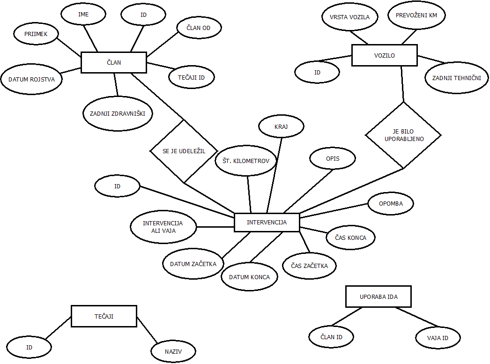

# GasilskaBrigada

Avtorja: 
* Lea Pečnik
* Alenka Kejžar

Seminarska naloga pri predmetu Podatkovne baze 1.

## Opis
V bazi bomo hranili podatke o članih prostovoljnega gasilskega društva, o intervencijah in vajah ter o vozilih.
Končni izdelek bo spletna storitev v kateri bo uporabnik lahko:

* pregledoval intervencije in vaje
* dodajal nove člane, intervencije in vaje
* naredil poročilo preteklega leta
* preveril kdaj je član uporabljal IDA
* posodabljal podatke o vozilu, članu

## ER diagram

